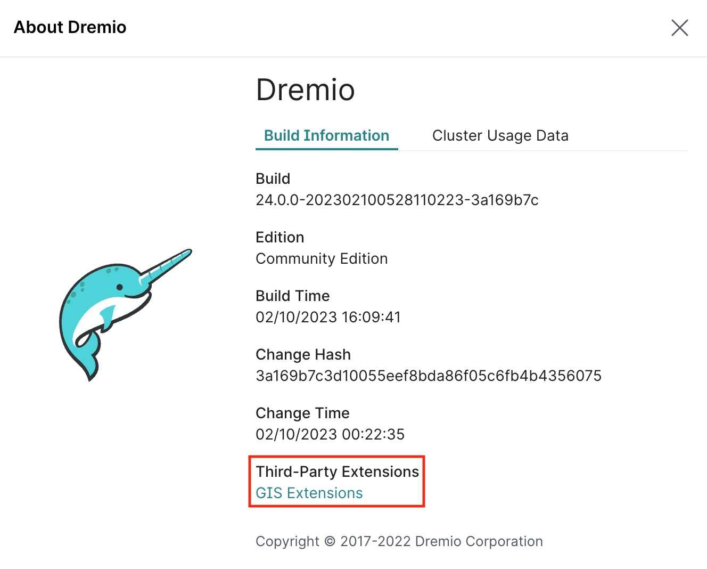

# Dremio Docker Build with Dezota Extensions

This docker build is different from the standard Dremio OSS build in the
following ways:

1. Patched Dremio OSS to support longer Varchar and VarBinary fields (needed
to support GIS geometry length).  Keep in mind that these values only define 
an absolute maximum but will not inflate the size smaller values.

   - Moved default size to 10,485,759 bytes from 31,999 bytes
   - Moved maximum size to 10,485,759 bytes from 65,536 bytes 

2. Incorporate support for ClickHouse as a Datasource from:

   - https://github.com/Dezota/dremio-clickhouse-connector

3. Incorporate GIS functionality including GIS function search in *Dremio Analyst
Center* UI

   - https://github.com/Dezota/dremio-gis-extensions

## Building and Running Docker Image

```
cd ./build
make build
make run
```

## Using the Docker Hub Image



Get the image from Docker HUB:
```
docker pull dezota/dremio-oss-with-ext:20.1.0-8
```

Here is the digest for the this version on hub.docker.com:
```
20.1.0-8: digest: sha256:a4b72df504208b3a0ad510bbf97414ace51a61b73d72e797b29950436791f046 size: 2627
````

*Comment out build line in docker-compose.yml:*
```
# build: ./build
```

Launch Dremio with Dezota Extensions in the Background:
```
docker-compose up -d
```
